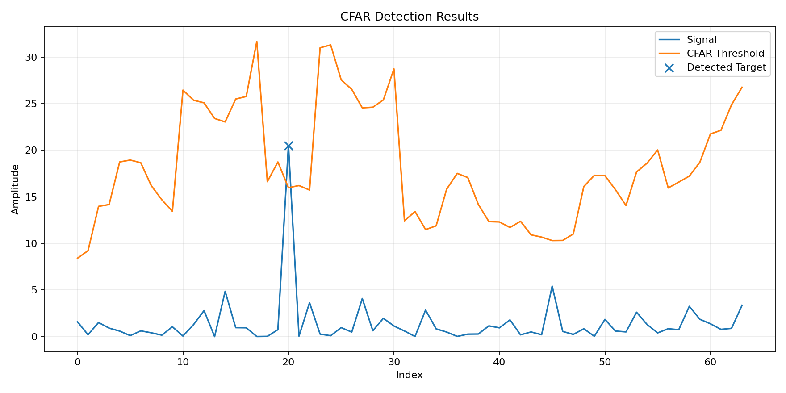

# Simple CFAR Detector

This is a small C++ project about CFAR and radar target detection.

In radar, the signal coming back from the environment can contain a lot of noise. This makes it harder to tell if a value is a real target or just noise.

CFAR checks the values around the current point and uses them to set a threshold. If the current value is higher than the threshold, it can be detected as a target.

The basic idea is:

```text
Look at nearby values
        ↓
Estimate the noise
        ↓
Calculate threshold
        ↓
Check the current value
        ↓
Target or not
```

For this project, I created a simple signal with random values and added two bigger values as target examples:

```cpp
profile[20] += 20.0;
profile[45] += 4.0;
```

The detector goes through the signal and checks each sample.

## Parameters

The current values are:

```text
Training Cells : 8
Guard Cells    : 2
Pfa            : 1e-4
```

The cells around the test sample are used like this:

```text
Training   Guard   Test   Guard   Training
[ ][ ][ ]  [ ]      X      [ ]    [ ][ ][ ]
```

Training cells are used for the noise calculation.

Guard cells are skipped because they are close to the sample being tested.

If the sample is above the threshold, it is marked as a target.

## CFAR Type

This project uses **CA-CFAR**.

CA-CFAR takes the average of the training cells.

For example:

```text
2  3  2  4  3  2

Average = 2.67
```

This average is used as the noise value.

## Other CFAR Methods

There are also other CFAR methods.

### GOCA-CFAR

It checks the left and right sides separately and uses the bigger one.

```text
Left  = 2.1
Right = 5.4

Use 5.4
```

### SOCA-CFAR

It uses the smaller one.

```text
Left  = 2.1
Right = 5.4

Use 2.1
```

### OS-CFAR

It sorts the training cells and picks one value from them.

```text
Before:
2  3  8  2  4  3  2

After:
2  2  2  3  3  4  8
```

These methods are not implemented yet.

## CSV Output

The program creates:

```text
cfar_results.csv
```

The file contains:

```text
index,value,noise,threshold,is_target
```

This makes it easier to check the result for every sample.

## Graph

The CSV output was also used to create this graph:



## Build

The project uses C++17.

```bash
g++ -std=c++17 main.cpp -o cfar
./cfar
```

After running the program, `cfar_results.csv` is created in the same folder.
